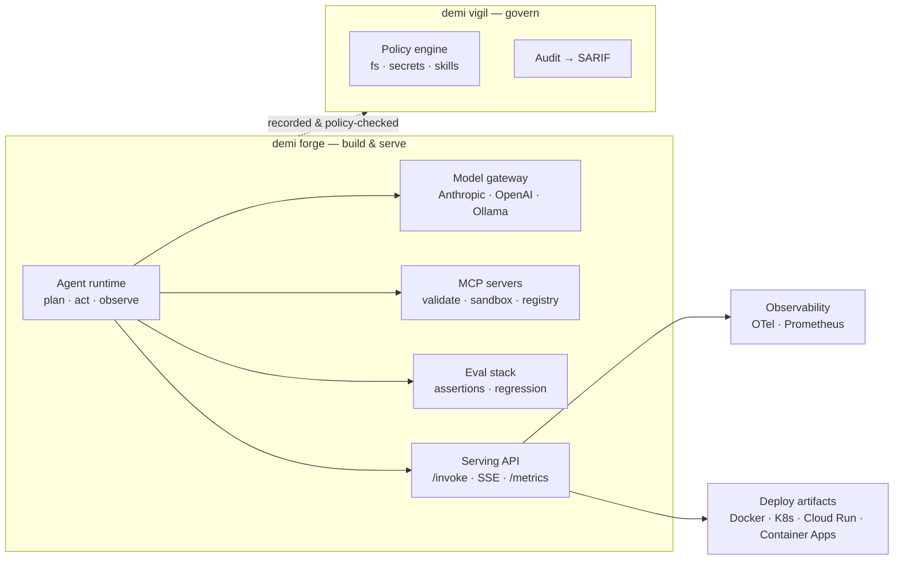

# Demigo Tools 🦉

### In tandem with AI.

*Pronounced **DEM-ee-go** — "Demi," your companion, ready to go.*

[](https://github.com/ceasarb/demigo-tools/actions/workflows/ci.yml)
[](go.mod)
[](https://goreportcard.com/report/github.com/ceasarb/demigo-tools)
[](LICENSE)

**A platform for building, serving, evaluating, and governing production AI agents.** Demigo Tools is the
infrastructure other builders stand on: scaffold an agent, wire it to MCP tools, prove it with evals,
serve it behind an HTTP API, and ship it to Docker / Kubernetes / Cloud Run / Container Apps — with
tracing, budgets, and policy enforcement wired in from the start. It's the Go toolchain behind
**[Demigo](https://github.com/ceasarb/demigo)** — one platform for the whole lifecycle of building
*with* AI: **decide → build → govern**. This repo is the **build** and **govern** halves; the **decide**
half is the `/demi:` method that installs into Claude Code from the
[demigo](https://github.com/ceasarb/demigo) repo.

```
demi           the dispatcher — one verb over two tools
├── demi forge     build your AI    — agents, MCP servers, skills, evals, serve, deploy
└── demi vigil     govern your AI   — sessions, policy, audit, SARIF
```

One shared SKILL.md parser keeps the two honest; two independently-releasable binaries keep them
decoupled.

---

## Platform capabilities

Everything below is wired and tested today — not roadmap.

| Capability | What it gives you |
|---|---|
| **Agent runtime** (plan · act · observe) | Tool-call loop with sequential *and* parallel tool execution, streaming activity sinks, per-session cost accounting |
| **Model gateway** | One `Provider` interface over Anthropic, OpenAI, and Ollama — plus HuggingFace weights via `hf:` refs. Swap models without touching agent code |
| **MCP toolchain** | Scaffold → hot-reload dev REPL → protocol-compliance validator (naming, schema, security, errors, pagination, annotations, response shape) → registry → sandbox |
| **Eval stack** | 20 assertion types (tool-use, output, cost, latency, MCP response shape), baseline snapshots for regression detection, HTML reports |
| **Serving API** | `POST /invoke`, `POST /invoke/stream` (SSE), `GET /health`, `GET /ready`, `GET /metrics` — the internal "assistance API" other services call |
| **Observability** | OpenTelemetry (OTLP) traces, Prometheus metrics, health/readiness probes, a session recorder for replay |
| **Guardrails & reliability** | Per-request + monthly cost budgets enforced at serve time, provider retry honoring `Retry-After` with exponential backoff, sandbox egress firewall (iptables allowlist, default-DROP) |
| **Deploy** | Generate Docker, Kubernetes, Cloud Run, Container Apps, and GitHub Actions artifacts from one agent config |
| **Governance** (`vigil`) | Wrap any AI coding session in a recorded, policy-checked run with filesystem/secrets/skills policy and SARIF output for CI |

### Architecture



---

## Install

Requires Go 1.25+.

```bash
git clone https://github.com/ceasarb/demigo-tools.git ~/Developer/demigo-tools
cd ~/Developer/demigo-tools
make install     # builds & installs: demi (dispatcher), demi-forge, demi-vigil
```

`make build` drops the binaries in `./bin/` instead. `make ci` runs vet + build + test (the same
checks CI runs).

---

## `demi forge` — build

Take an agent from prototype to production: scaffold it, wire MCP servers and skills, run eval suites,
serve it behind an HTTP API, and generate deploy artifacts.

**The flow — zero to a deployed agent:**

```bash
demi forge init my-workspace                 # scaffold a .demi/ workspace
demi forge agent create researcher           # new agent → agent.yaml
demi forge server create fetch               # new MCP server the agent can call
demi forge agent add-server researcher \
  --server ./servers/fetch                   # wire the server into the agent
demi forge agent skill create summarize      # scaffold a SKILL.md and attach it
demi forge agent chat researcher             # talk to it locally to sanity-check
demi forge agent eval researcher             # run eval suites — prove it works
demi forge agent serve researcher            # serve it behind an HTTP API (see below)
demi forge agent deploy researcher \
  --target kubernetes                        # emit deploy artifacts (see targets below)
```

`agent deploy --target` is required; pick one of `docker`, `kubernetes`, `cloud-run`,
`container-apps`, `github-actions`, or `all`. Artifacts land in `./deploy/` by default.

### Serving API — the "assistance API"

`agent serve` puts an agent behind a small, production-shaped HTTP surface that internal services can
call. Auth is on by default (auto-generated bearer token); `--no-auth` is for local dev only.

```bash
demi forge agent serve researcher --no-auth --port 8080

# Blocking call — JSON in, JSON out
curl -s localhost:8080/invoke \
  -H 'content-type: application/json' \
  -d '{"message": "Summarize the latest release notes"}'
# → {"response":"…","usage":{"input_tokens":…,"output_tokens":…},"tool_calls":2,"cost_usd":0.0123,"model":"…"}

# Streaming call — Server-Sent Events (text, tool_start, tool_result, done)
curl -N localhost:8080/invoke/stream \
  -H 'content-type: application/json' \
  -d '{"message": "Research and draft a summary"}'
```

| Endpoint | Purpose |
|---|---|
| `POST /invoke` | Blocking invocation; returns response + usage + cost |
| `POST /invoke/stream` | SSE stream of tokens and tool-call events |
| `GET /health` | Liveness probe |
| `GET /ready` | Readiness probe |
| `GET /metrics` | Prometheus metrics |

Every response carries cost/usage headers — `X-Ajnt-Tokens-In`, `X-Ajnt-Tokens-Out`, `X-Ajnt-Cost`,
`X-Ajnt-Monthly-Remaining` — and the server returns `429` when the rate limit trips and
`X-Ajnt-Budget-Exceeded` when a monthly cap is hit. `--sandbox` runs bundled MCP servers in
egress-firewalled containers.

### Evals as a first-class gate

Evals are how you keep an agent honest across changes, not an afterthought.

```bash
demi forge agent eval researcher               # run the agent's suites
demi forge server eval fetch                   # run an MCP server's suites
```

20 assertion types span tool use (`tool_called`, `tool_sequence_includes`, `max_tool_calls`), output
(`output_contains`, `output_matches`), budgets (`max_cost_usd`, `max_tokens_used`,
`max_latency_seconds`), quality (`no_hallucinated_stats`, `cites_data_source`), and MCP response shape
(`schema`, `golden_file`, `range`). Baseline snapshots catch regressions run-over-run, and results
render to HTML reports.

### Observability

Agents emit OpenTelemetry (OTLP) traces and Prometheus metrics — request counts, tool-call latency,
token and cost counters — out of the box, with a session recorder for replay. Point `GET /metrics` at
Prometheus and the OTLP exporter at your collector; the `deploy` targets wire the annotations for you.

### Command reference

Top-level forge groups are `agent`, `server`, and `model`, plus `init` and `dashboard`:

| Group | What it does | Notable subcommands |
|---|---|---|
| `agent` | Agent lifecycle | `create`, `chat`, `inspect`, `add-server`, `skill`, `eval`, `serve`, `deploy`, `export` |
| `server` | MCP server lifecycle | `create`, `dev` (hot-reload REPL), `test`, `validate`, `sandbox`, `eval`, `registry`, `deploy` |
| `model` | Local models | `pull`, `list`, `remove` (Ollama / HuggingFace) |
| `dashboard` | Local web UI over agents, servers, evals, and sessions | — |

`agent skill` (create / test / attach / detach / list / pack) manages SKILL.md skills;
`server registry` discovers and publishes MCP servers. Run `demi forge <group> --help` for the full list.

## `demi vigil` — govern

Wrap any AI coding session (Claude Code, Codex, Cursor, or a bare command) in a governed, recorded,
policy-checked run — with filesystem/secrets/skills policy and SARIF output for CI.

**The flow — govern a working session:**

```bash
demi vigil init                       # scaffold .demi/vigil.yaml + policy (commit these)
demi vigil start                      # open a governed, recorded session
demi vigil run claude                 # launch a tool inside it (claude / codex / cursor / any command)
demi vigil stop                       # finalize and persist the session
```

**Then inspect and enforce:**

```bash
demi vigil sessions                   # list recorded sessions
demi vigil log                        # replay the last session's activity
demi vigil report                     # usage report across recorded sessions
demi vigil audit --ci --format sarif  # re-check a session / git range → SARIF for CI
demi vigil policy show                # print the merged org + repo policy
demi vigil skills scan                # discover skills, then `skills check` them against policy
```

`audit` also takes `--base-ref` / `--head-ref` to check a git range instead of a session, and `--ci`
exits non-zero on error-level violations — drop it into a pipeline as a gate. `policy validate` catches
locked-field violations before they ship.

---

## On-disk layout

Everything Demigo writes lives under a single `.demi/` directory:

```
.demi/
├── forge.yaml          # forge workspace marker (committed)
├── vigil.yaml          # vigil governance config (committed, CODEOWNERS-friendly)
├── forge/              # forge runtime state (gitignored)
└── vigil/              # vigil sessions & state (gitignored)
```

## Repo layout

```
demigo-tools/
├── cmd/
│   ├── demi/           # the dispatcher
│   ├── demi-forge/     # build binary
│   └── demi-vigil/     # govern binary
└── internal/
    ├── forge/          # agent runtime, model gateway, MCP toolchain, evals, serving, deploy
    ├── vigil/          # sessions, policy engine, audit, SARIF reporting
    └── skill/          # the one shared SKILL.md parser
```

## License

MIT. See [LICENSE](LICENSE).
